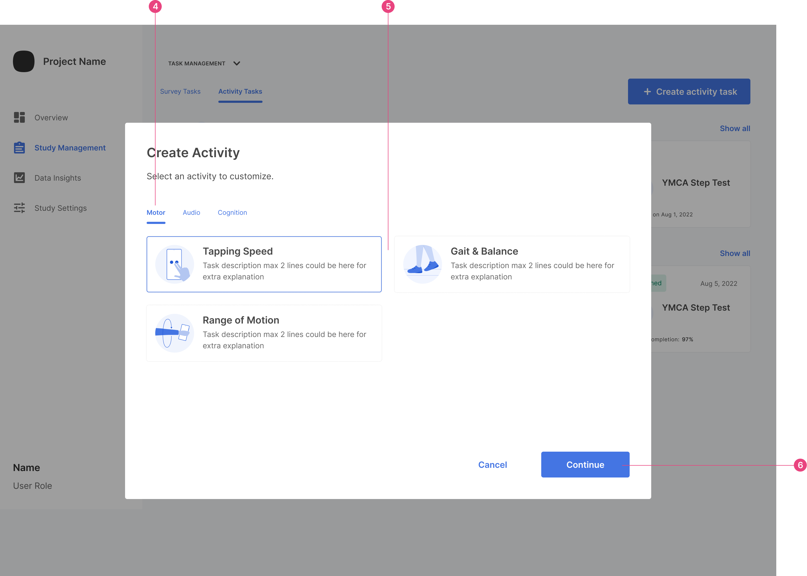
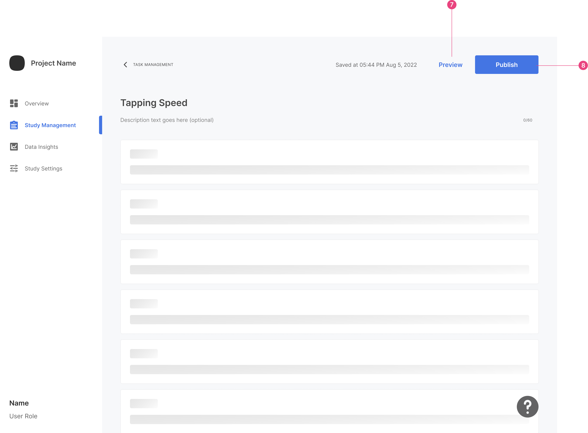

1. To create an activity, go to `Study Management` and click `Activities`.

2. Click on `Create Activity.`

   

3. You can see all the drafts and published activities here on the activities page. If you have any activity already started, you can select from here.

4. Select the category of activity. 

   

5. Select Activity; in the example, we are picking `Tapping Speed`. 

6. Click `Continue`. This will load the activity screen.

   

7. Click `Preview` to check how the activity will look for the user. 

8. Once you are done editing, click `Publish`. 

