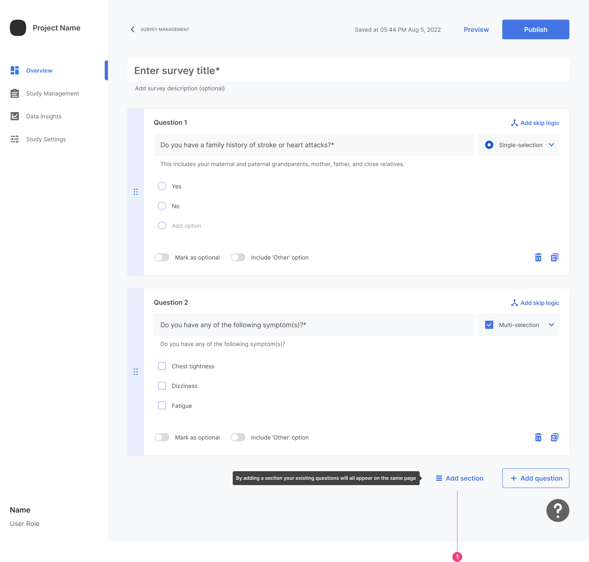
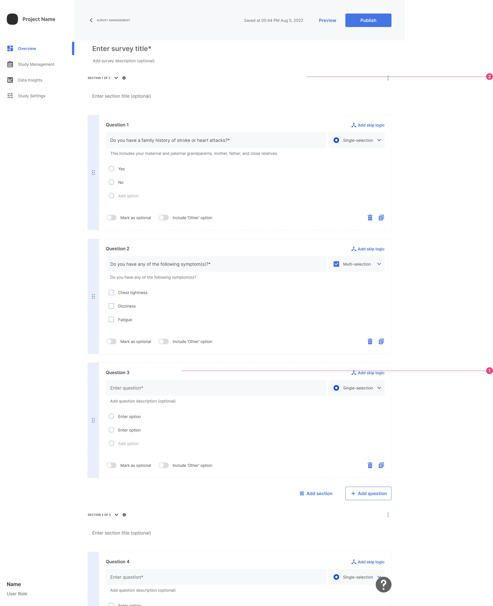
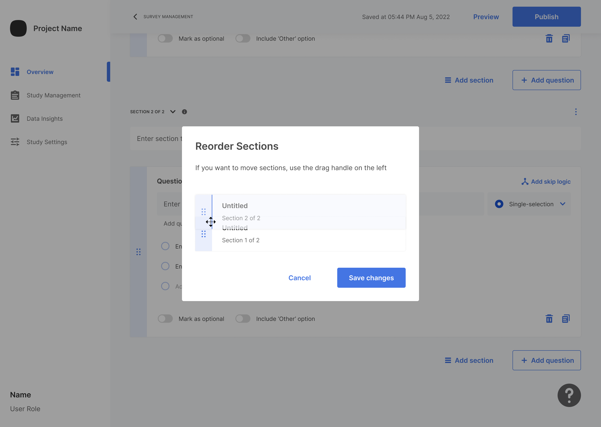

Survey Grouping is a helpful feature allowing you to organize survey questions into sections. 

 

This feature is useful in managing large surveys and enhancing respondent experience. 

## Add Section

Click "Add Section" to group your existing questions into a section. If there are already sections, this action will add a new section below them, equipped with a new empty question card.

Once you click "Add Section", all current questions are sectioned, and a new section is added.

1. The Section Title field is optional and doesn't appear on SDK. It's meant for organizational purposes.
2. When you add a section for the first time, the ungrouped existing questions are grouped into one section. A new section with an empty card appears. If you add a section after existing ones, it appears below the section where you clicked the button.
3. The tooltip appears only by hovering over the info icon.
4. The question card number continues from the previous cards.

## Collapse Section

If your survey gets crowded, you can collapse each section. Click the collapse icon located above the section title to do this.

Collapsing a section keeps the section title (even if empty) and the Section Action button visible.

## Section Actions

Click on the three-dot menu next to the section title text box to access section actions.

1. The first section's actions do not include the "merge to section" option.
2. From the second section onwards, the "merge to section" option is available.

## Merge Section

Click the three-dot menu and select Merge Section. In the example above, it's "Merge to section above".

Once clicked, the section will be merged. 

1. Card numbers change to follow the logic from the question cards above when merging. If a merged section has a title, it is overridden by the title above, even if it is empty.
2. If the section above was collapsed before merging, it opens and displays the card in the middle of the screen.

## Delete Section

Inside the three-dot menu, click Delete Section to prompt a warning pop-up.

Clicking the Delete Section button deletes all questions, skip logic, and rules within this section.

## Reorder Sections

Inside the three-dot menu, click Reorder Section to open a new window.

You can drag and drop each section to its correct position. While reordering, the names remain the same, but section numbers change to reflect the new order.

Click Save Changes to preserve the new section order.

## Preview Sections

Click the Preview button to view a survey without sections.

1. Dropdown options are questions.
2. Each question card represents a new page on SDK.

For sections preview, it looks a bit different.

1. Dropdown options are sections.
2. Each grouped question card is shown on the same page.

