# Adding Educational Content

You can add educational content to help users understand the studies, provide articles, or add texts answering their questions. This shows in the `Education` section within the phone.

 To add a publication go to `Survey Management` and scroll down to `Educational Content Management`.

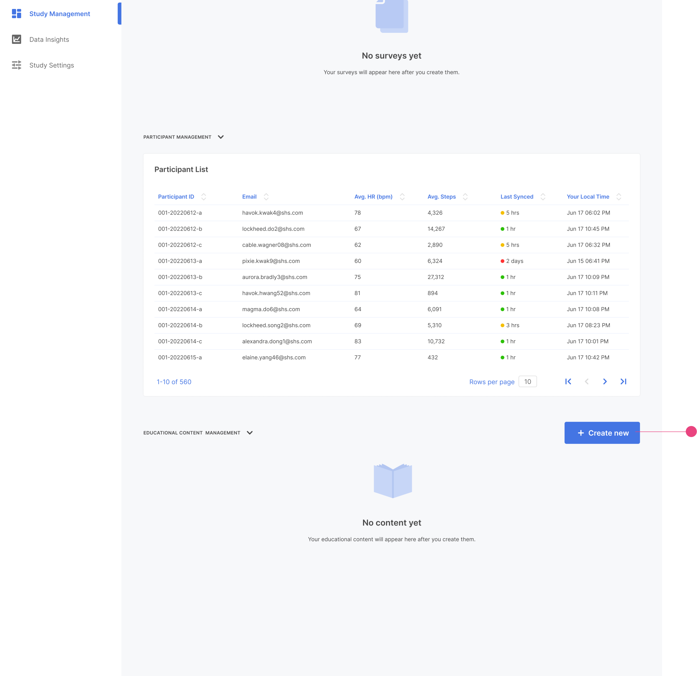

Click `Create New`.

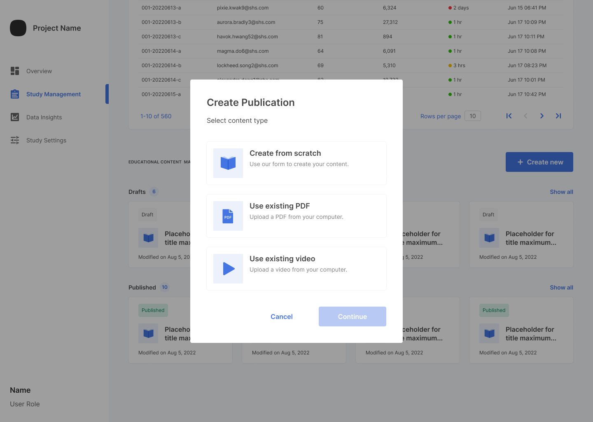

There are three different ways to create publications. 

- Create from Scratch
- Use Existing PDF
- Use Existing Video 

## Create from Scratch

To create a new publication, click `Create from Scratch` and then `Continue`.

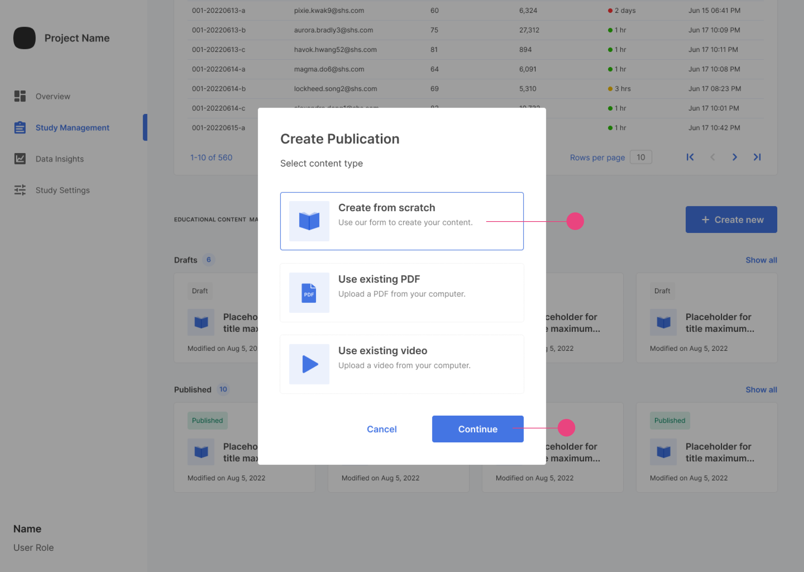

This will start the process.  

Add the needed information.

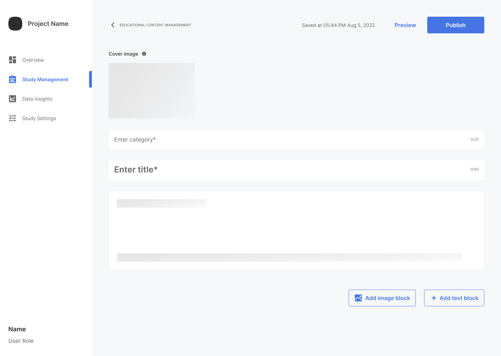

Once the information is added, you can preview the publication by clicking `Preview` and publish by clicking `Publish`. 

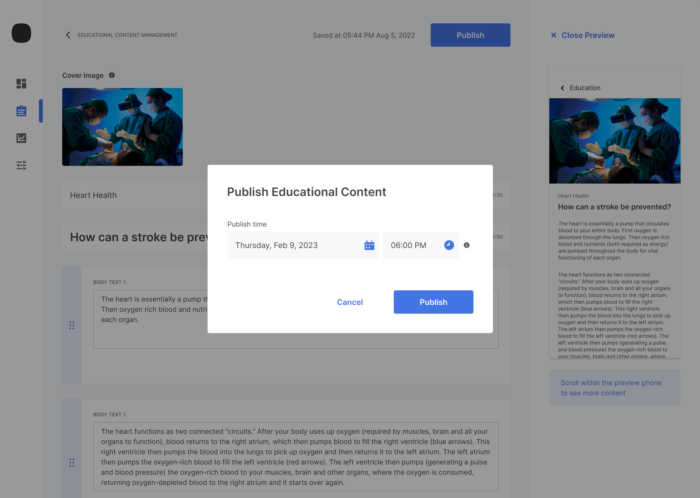

You can select when the content will be published when `Publish` is clicked. 

## Add PDF

To create a publication using PDF, click `Add PDF` and then continue`.

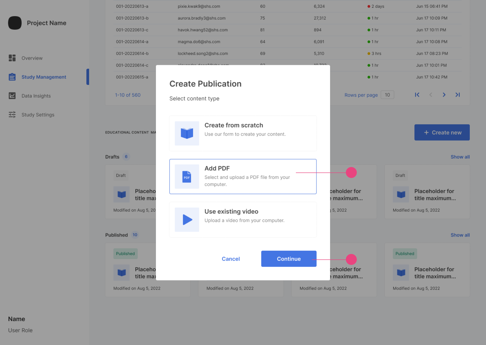

You can add the PDF and any text along with the pdf.

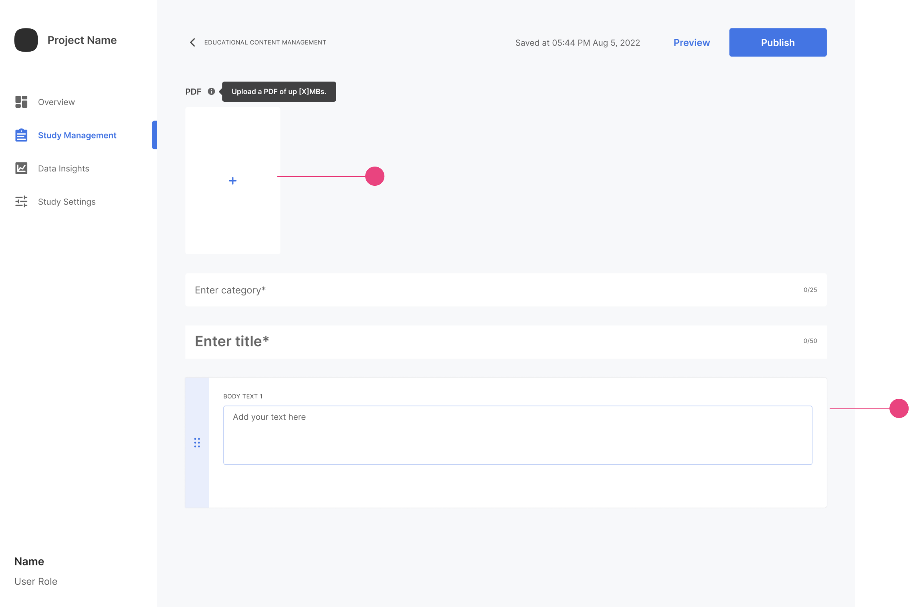

Once information is added, you can preview and publish the publication similarly to `Create from Scratch`.

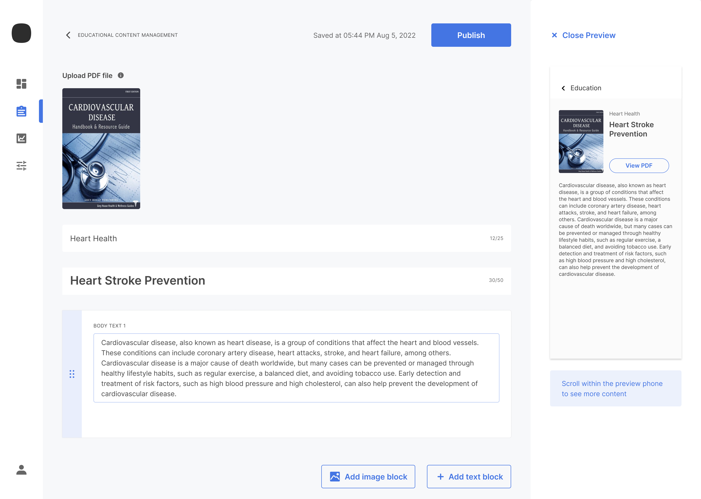

## Use Existing Video 

To create a publication using video, click `Add video` and then click `Continue`.

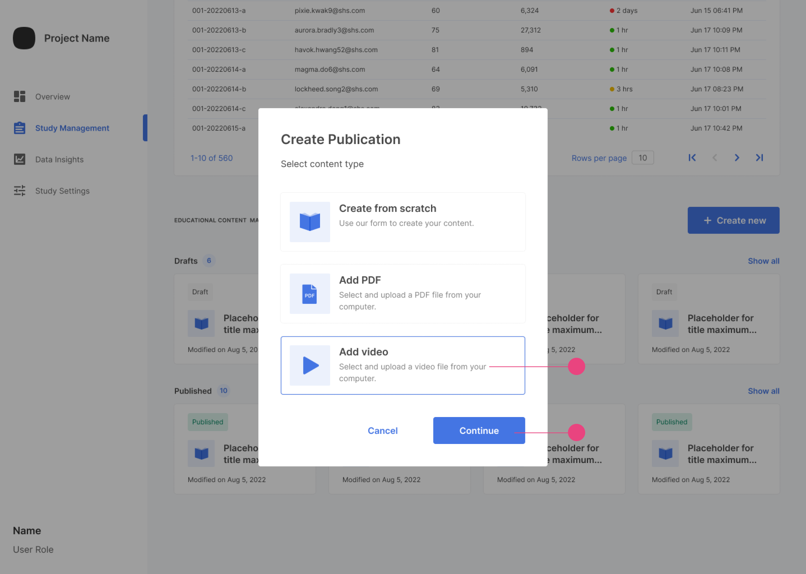

This will take you to the content creation page for video publication.

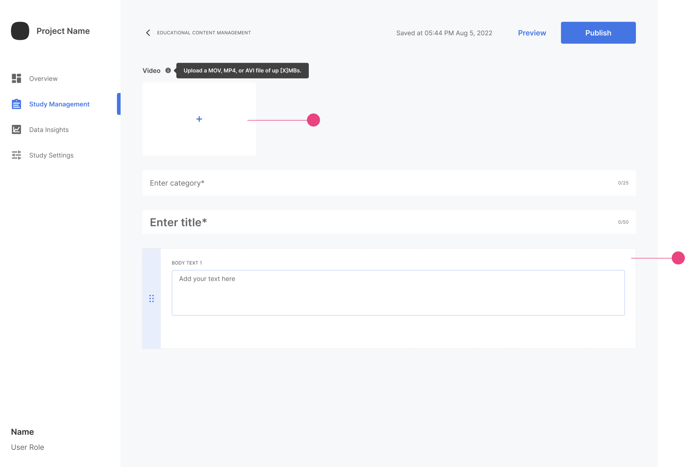

You can upload your video and add any necessary content. Once you add the information, you can preview and publish the publication similarly to other publications.

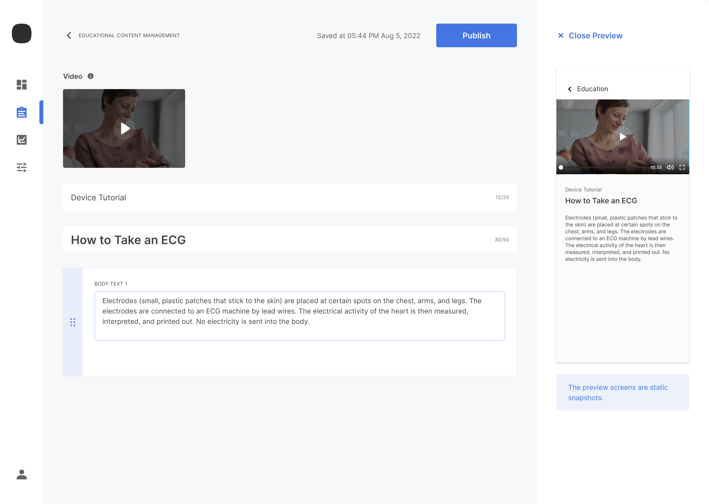

# Managing Educational Content

You can view all the drafts and published items in the `Educational Content Management section. 

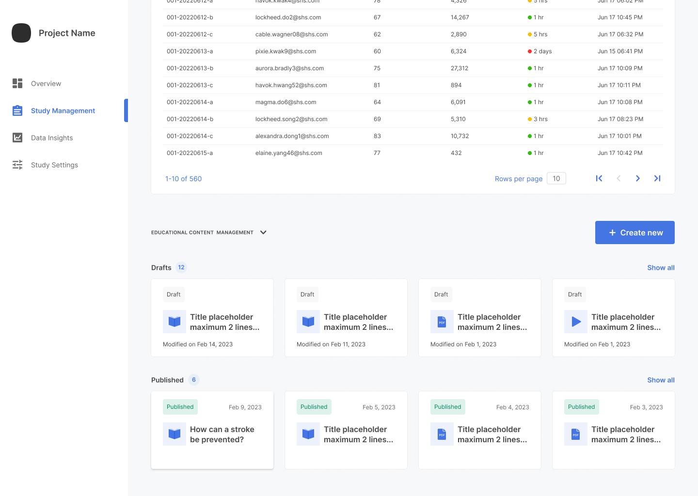

`Draft` and `Publication` sections will expand by clicking on `Show All` to display all educational content cards in this category. Each Publication has a time estimation for it. 

## Reading Time Estimation

Reading estimation time varies for each type of publication. For PDFs, it is 30 seconds per page; for video, it is the video total time; for text-based publication, it is 30 seconds per page (before scrolling) OR 238 words per minute.