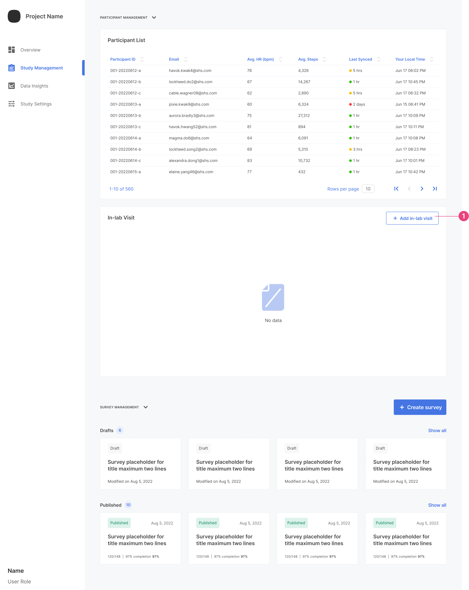
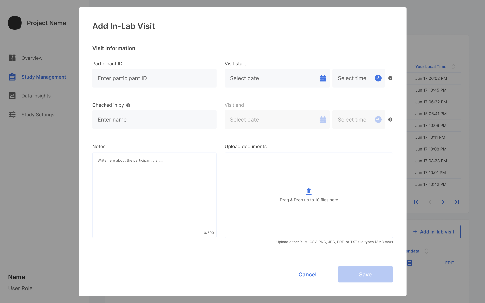
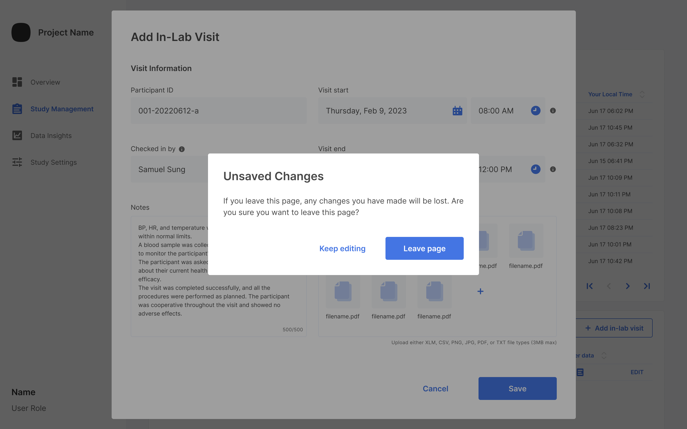
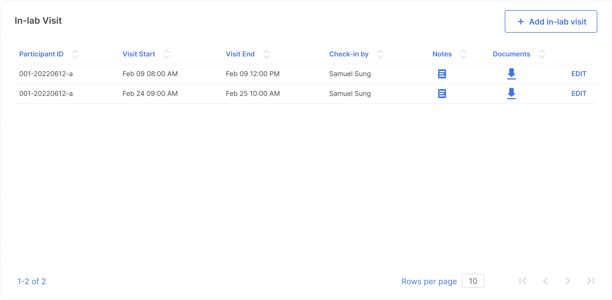
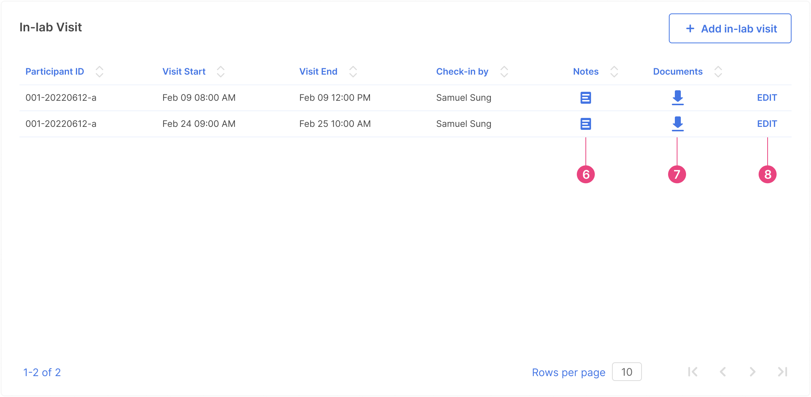
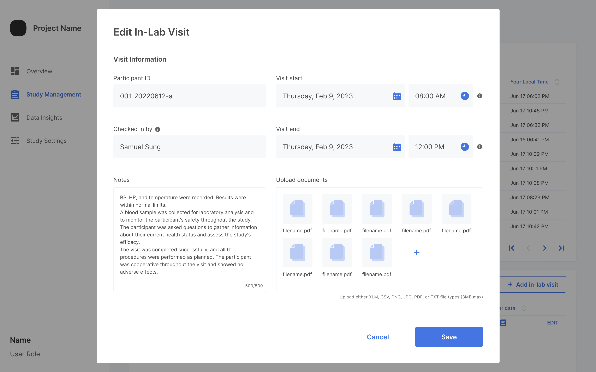

To add an In-Lab Visit to `Study Management` of your study. When you scroll down within `Participant Management, you will see a section called In-lab Visit.

1. Click on `Add In-lab Visit`. This will pop up the information collection screen. 

   

2. Add all the information for the In-Lab Visit. You can attach any files and add any notes relating to the visit.

   

3. After the information is added, click `Save`. If you decide to click `Cancel`, a warning popup will show.

   

4. Once the content is saved, it will show within the In-lab Visit dashboard.

   

5. You can edit notes, download visit information, or edit the whole visit from here. 

   

6. When editing notes, a new window will pop up. Click `Edit note` to edit the information.

   

7. The download button will start the download process, and when the information is downloaded successfully, it will show the following:

   

8. Editing the whole visit will show a similar window as adding a visit and you can edit any information. Click `Save` when done.

   