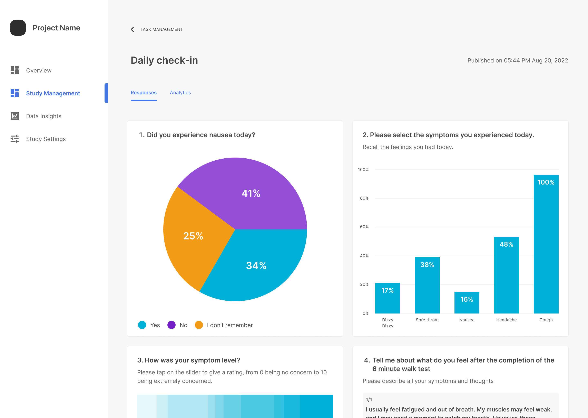

The web portal provides easy visualization of survey response percentages. For each question in published survey, an appropriate chart shows options chosen by percentage. Up-to-the-minute data is available throughout your study and after.

To view survey responses:

1. From the **Study Management** page, navigate to the **Survey Management** section.

2. Under **Published**, click any survey.

3. Click the **Survey Responses** tab.

    

4. Scroll through the charts to view the percentages for each question.
