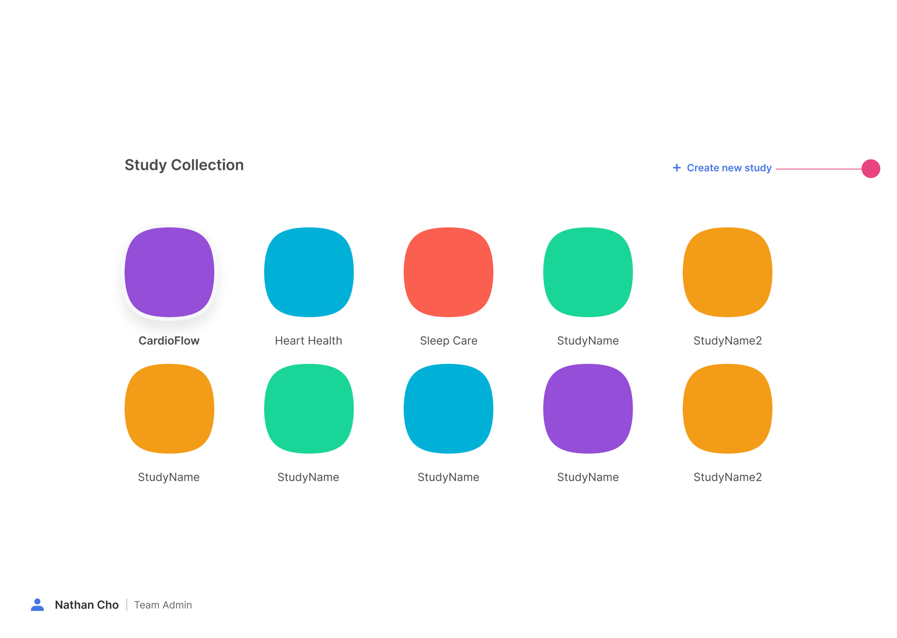
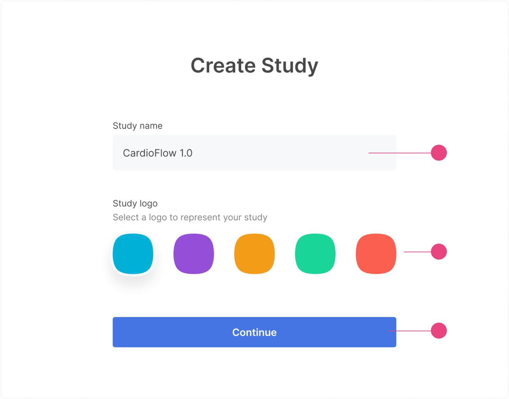
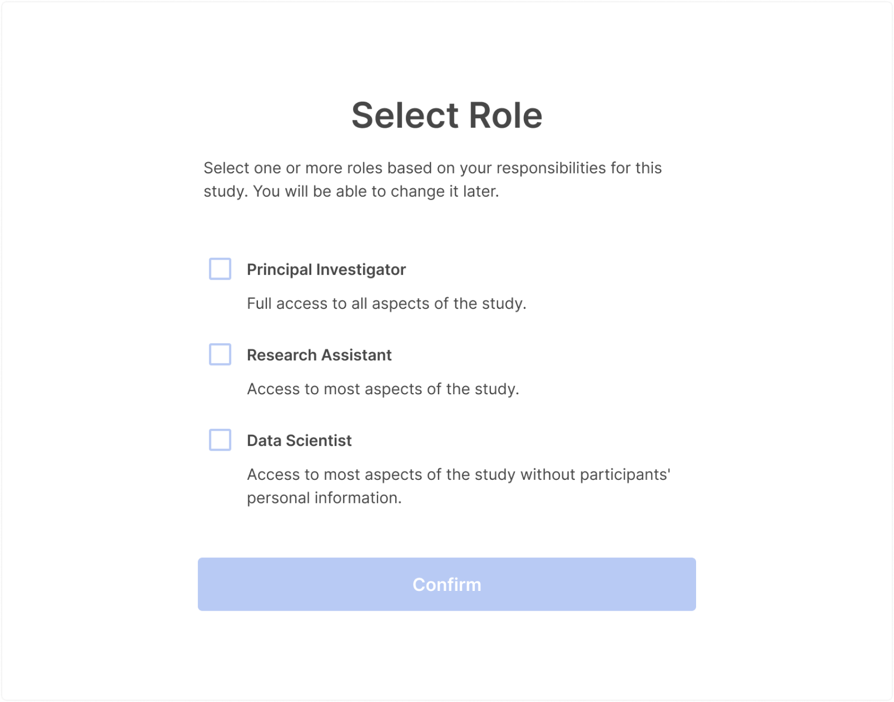
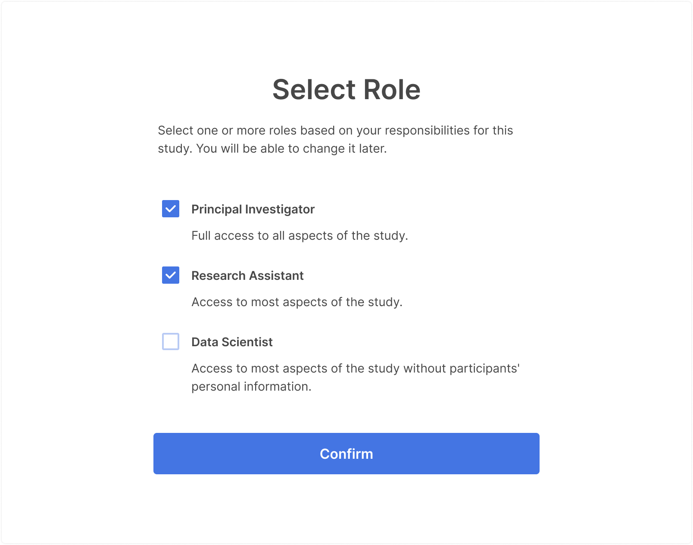
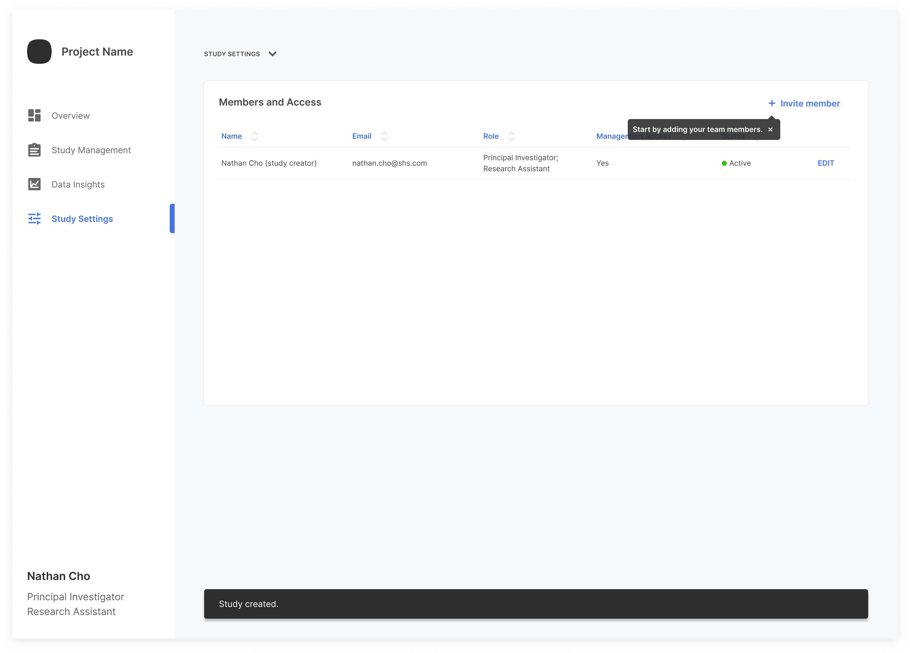

A Samsung Health Stack study is a container you create to manage all aspects of your participant study. A container consists of the team members running the study, the list of participants, participant surveys, survey results, participant vital signs tracked through the wearable device, graphs giving insights into the data collected, and more.

> As of this writing, Chrome is the only browser supported for accessing the web portal.

To create a new study:

1. From anywhere within the web portal, click the current study name displayed in the top left corner of the portal window.

    

2. On the `Study Collection` page that appears, click `Create New Study`.

    > When logging in to the portal for the first time, the **Create a Study page automatically appears instead.

3. Enter a name for your study. Select a color for the study logo. Click `Continue`.

    

4. Select the necessary role(s) for yourself. 

    

5. Click `Confirm`.

    

6. This will take you to the `Study Settings`. 

    

You can invite members or edit the study settings on this screen. 
