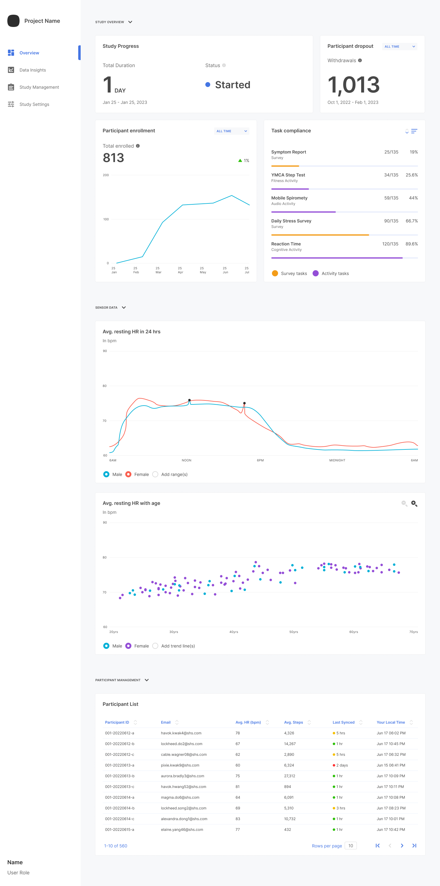

---

title: Study Overview Page
sidebar: doc_sidebar
permalink: study-overview-page.html
toc: false
---

The Project Overview screen is the first choice on the left navigation, providing users with various stats. It contains various stats about the study under `Study Overview` and sensors under `Sensor Data`. 

 

The `Study Overview` contains information about the following:

- Study Progress: Provides the duration and the status of the study.
- Participant Dropout: The number of individuals who dropped out of the study within a specified time. The time can be modified to be `All Time`, `Last 30 Days`, `Last 7 Days`,  and `Last 24 Hours`.
- Participant Enrollment: Total number of invited people who are eligible, have completed onboarding, and have not withdrawn within a selected time.  The time can be modified to be `All Time`, `Last 30 Days`, `Last 7 Days`,  and `Last 24 Hours`.
- Task Compliance: Contains all the surveys and activity tasks within the study. You can filter by high to low or low to high. You can create [surveys](creating-a-survey.html) and [activities](creating-an-activity.html) within `Study Management`.

The `Sensor Data` section provides data based on the sensors being used within the study. 

The `Participant Management` section provides information about all participants in the study. 
